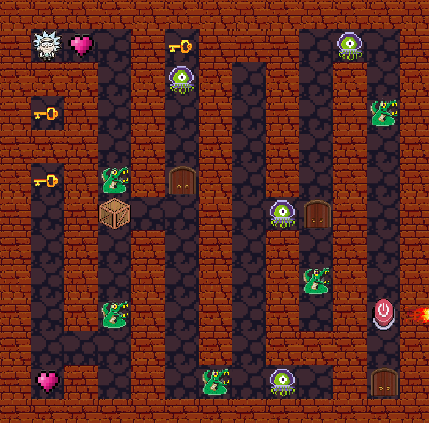

# Jogo 2D em Java

Foi desenvolvido um jogo 2D, onde há 3 fases, controlamos Um personagem que precisa atravessar um labirinto para avançar de fase, a cada fase há monstros que podem ser derrotados, foi utilizado os conceitos de  orientação a objetos para esse projeto.

Abaixo está a imagem do jogo aberto, onde o personagem principal "Rick" precisa atravessar o labirinto para passar de fase.

Para executar esse jogo é necessário, ter o javac/JDK instalado em sua máquina:

1 - Ir para a pasta projeto_puzzleGame
2 - Ir para a pasta src
3 - Na pasta source escrever no terminal "javac Main.java"
4 - Após isso, no terminal "java Main"

Se divirta!!1
